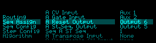

# SongSequencer

Make a song by sequencing other sequencers.  Made for the Expert Sleepers Disting NT.

## Overview

Song Sequencer is used to sequence other sequencers to form a song.  Think of it as a 8:1 switch for sequencers; up to 8 input sequencers are switched to the master outputs at the right time.  Sequence the Disting NT's "Step Sequencer" or external sequencers (via CV and gates), and includes a transpose cv added to pitch, and assignable CV output (WIP).

## Key Features

- Sequence up to 8 other sequencers (external modules) over 8 steps 
- Sequence the Expert Sleeers Disting NT Step Sequencer by selecting from its 32 sequences for each of the 8 steps
- Sequence phrase repeats up to 16 times per step 
- Set On Off switches for the 8 steps of the song that may be "played" via the custom user interface (UI)
- Use a Master reset input to reset Song Sequencer to the first step that is "On"
- Send Reset triggers at end of each sequence 
- Share the Reset output across all sequencers
- Use a Beat (tempo) input and Bars/Beats per Bar to control when to switch to the next sequencer step
- Pass Pitch CV Output with transpose CV input (unquantized) to a common CV output
- Pass Gate Output that follows the assigned sequencer (ie. independent of the beat clock tempo) to a common Gate Output
- Pass an Assignable CV Output (pass any CV from the input sequencer for a step to an output) (WIP) 

## Custom User Interface

The **Custom UI** displays 8 song steps in a grid where each step has:

- Assigned Input sequencer (A through H)
- Repeat value (0 through 16)
- On|off step switch

A "Step" is simply a phrase implemented in some sequencer.

It is "playable" by changing the assigned sequencer to each step, the repeats, and switching steps on or off.

## Navigation

**Navigate**

- Navigate the grid with the left and right encoders (bottom row, not the top row of Pots)
- Turn left encoder to navigate horizontally across steps
- Turn right encoder to navigate vertically across rows 

**Change Values** 

- Press, hold and turn the Right Pot (top row); ie. press and hold to change a value. Release it when done.
- For quick changes of switches, just click to enter the value from the POT (most useful for switch changes)

## Song Sequencer Outputs

Song Sequencer outputs the following for the current step (active sequencer A-H on steps 1-8):

- Pitch (with optional Transpose CV added)
- Gate, 
- Reset trigger output (optional) and normally connected to the assigned sequencers reset input; trigger duration is 25ms across all sample rates
- St.Seq. Output - this output is intended to be used for the Disting NT Step Sequencer's "Sequence CV Input)" to select 1 of 32 Sequences
- Seq (A..H) ST Seq # - this selects the NT's Step Sequencer Sequence (1..32) to be sent out on St.Seq. Output
- Assignable control voltage (CV) (optional) (WIP)

The assignable control voltage can be anything but most commonly would be used for something like velocity. (WIP) 

## Song Sequencer Inputs

### Common to all sequencers:

- Beat used to count beats and measures to advance steps
- Reset used to reset back to the first enabled step

### Each Sequencer (A..H) sends to Song Sequencer:

- Pitch (with optional added Transpose CV)
- Gate
- Transpose CV
- Assignable Input CV (WIP) to be used for something like Velocity or Bend

## How It Works

You can think of each step as being a part of a song, with an associated input sequencer.

### Beat Clock

Song Sequencer uses a master **Beat (clock)** input common across all sequencers.  The beat clock is used to advance to the next step by counting beats.

- Each sequencer has a **Bars** parameter and a **Beats Per Bar** parameter.   For example, if Bars = 1, and Beats per Bar = 4, Song Sequencer will count beats from the master beat input until it reaches 4, and then it will advance to the next sequencer step with an ON switch. 

- Sequencers can output CV/Gates in any timing not just "on the beat clock"; CVs and Gates are output independently from the beat clock
- Maximum 256 beats each sequence.

### Repeats

Each step has a **repeat control** allowing a sequence to be repeated up to 16 times on a step.  If it is set to zero, the sequencer for that step is run once and then Song Sequencer advances to the next step.  If it is set to 1..16 it will additionally repeat that sequencer that number of times.

### Step Switches On | Off

Each of the 8 steps has a **on | off Switch** that determines if Song Sequencer will run that step or not.  Any combination is valid; if all 8 switches are off there is no output of CV, Gate, or assignable CV. 

### Transpose

Each sequencer supports a **Transpose** input; the transpose CV value is added to the Pitch CV output. This is not quantized.

### Sequencer Reset Outputs

At the end of each sequence, Sound Sequencer issues a **Reset output** that can be routed to the Reset input on the sequencers so that the next sequencer starts on time.

### Master Reset Input
There is a master Reset Input that resets the internal state of SongSequencer, and sends a reset to the next (first) real sequencer.

## Custom User Interface Description

### First Row

- Shows Bars and Beats per Bar (Bpb) for the active step
- Rep n; shows the current repeat count of the active step
- Bar shows the current bar of the active step
- Beats shows the curent beat within the bar
- If configured, the CV value used to select sequences in the NTs "Step Sequencer" is displayed 

### Second Row

- Shows the step numbers from 1..8 (bright background)
- Each step may be assigned a Sequencer A..H

### Third, Fourth, and Last Row

#### SEQUENCER GRID

- SEQ shows the assigned sequencer A..H for the step
- REP shows the number of repeats for the step (0 means run the step once, 1 means repeat it once, etc.)
- On shows whether the step is on or off ("--"); 

### Tricks

- Change SEQ to some unassigned sequencer, and configure its bars/beats per bars: you will get "silence" or a rest step
- Change up the SEQ assignments, repeats, and ON OFF live to vary your song
- Use a sequencer to generate a transpose value as input
- Set the bars/beats per bar to be shorter than your sequencer; you can use the standard parameter screens to dynamically play from 1 to n sequencer steps

## Routing

- Reset Input
- Beat Input
- Pitch CV Output
- Gate Output
- Assignable Output

## Step Configuration

Step Parameters (per 8 steps) : Also managed by the custom UI for playability

- Assigned Sequencer (indicated by A..H)
- Repeat Count
- On or Off Switch (display shows "ON" or "--")

## Sequencer Assignment

- CV Input
- Gate Input
- Reset Output
- Disting NT Step Sequencer Output (patch this output to the NT's Step Sequncer Select Input)
- Disting NT Step Sequencer number (Use 1 Step Sequencer and select from one of its 32 internal sequencers)
- Transpose Input
- Assignable CV Input (WIP)

## Sequencer Configuration (per 8 sequencers A .. H) : Also managed by the custom UI for playability

 

These parameters let you control how many beats from the master beat input are used before advancing to the next sequencer. Match these setting to the input sequencers. 
- Bars
- Beats per Bar
- Maximums: 16 Bars * 16 Beats per Bar = 256 beats

Example: A typical 16 step sequencer could be set as:

A) 1 Bar, 16 steps per Bar = 16 beats
B) 2 Bars, 8 steps per Bar = 16 beats
C) 4 Bars, 4 steps per Bar = 16 beats

** The important thing as that 16 beats will be counted before Song Sequencer advances to the next step. 
You can, of course, set this up for a 4 step or 8 step sequencer (or whatever).

## Step Configuration : Also managed by te custom UI for playability

 

- Step n assigned Sequencer (A..H)
- Step Repeats
- Step Switch

## Installation

Copy SongSequencer.o to the Disting NT's Plugins folder.

## Building

-- Use the Makefile in the repository; you will have to adjust the path the api.h file
-- NB: Uses api version 1.8.  Module developed against firmware v1.9.0

## License

MIT License

## Background

Port from my HighSeq module developed for VCVRack.

